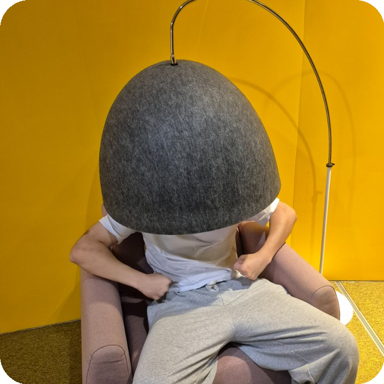

<table>
<tr>
<td width="42%" valign="middle">
  
</td>
<td valign="middle">

### SMERUXA

# [Алексей](https://smeruxa.ru/)
### разработчик интерфейсов

TypeScript · React · Node.js · PostgreSQL

 

[сайт](https://smeruxa.ru/) · [telegram](https://t.me/Smeruxa)

</td>
</tr>
</table>

---

## Обо мне

Делаю веб-сервисы и клиентские приложения. Можно целиком, можно отдельно: API, интерфейс, базу или инфраструктуру.

- Основной стек — **TypeScript**, **React**, **Node.js**, **PostgreSQL**
- На фронте: React, формы, состояние, адаптивная вёрстка
- Стараюсь писать понятный код, который проще поддерживать
- Заказы беру параллельно с работой: сначала уточняю объём, потом оцениваю сроки

---

## Стек

  

---

## Проекты

| Проект | Описание | Стек |
|:-------|:---------|:-----|
| [PlayTime](https://github.com/Smeruxa/PlayTime) | Десктопный мессенджер с голосовыми звонками | TypeScript |
| [tgcraft](https://github.com/Smeruxa/tgcraft) | Конструктор Telegram-ботов | TypeScript |
| [bb_balancer](https://github.com/Smeruxa/bb_balancer) | Балансировщик HTTP-запросов для Node.js | TypeScript |
| [STalk-Messenger](https://github.com/Smeruxa/STalk-Messenger) | Анонимный мессенджер с быстрыми ответами | TypeScript |
| [token-api](https://github.com/Smeruxa/token-api) | Генератор токенов по client secret и user-id | Go |
| [hand-cam-control](https://github.com/Smeruxa/hand-cam-control) | Управление ПК жестами через камеру | Python |
| [Pro-AutoClicker](https://github.com/Smeruxa/Pro-AutoClicker) | Авто-кликер на Qt | C++ |
| [PhantomPane](https://github.com/Smeruxa/PhantomPane) | Оверлей для Windows 10/11 | C++ |

---

  

---

  fullstack · интерфейсы · заказы · поддержка

